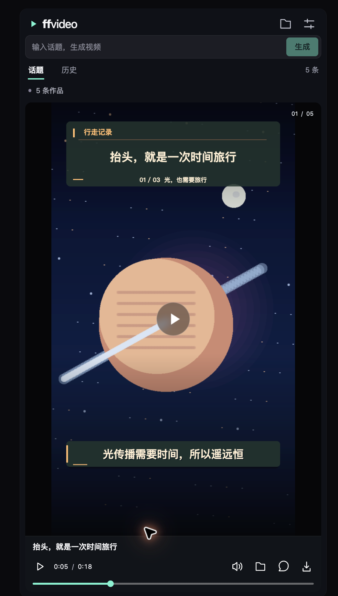

# ffvideo

## Copy this into your AI assistant

```text
Install the latest official npm package @ffclip-com/ffvideo. Set it up for this assistant, preserve my existing settings, and open the built-in video gallery in my browser. Use Node.js 22 or newer. If a new tool connection needs a restart, open the gallery with the CLI first. Show the bundled works before generating anything new.
```

## Or run this in your terminal

```sh
npm install -g @ffclip-com/ffvideo@latest && ffvideo --provider agent --open
```

[Chinese](README-zh.md) · [Website](https://ffclip.com)



Give your AI assistant a topic. Watch narrated video drafts, leave comments, and export.

- Turn a topic into narrated drafts with an AI assistant.
- Watch a simple gallery with captions and playback controls.
- Reuse templates, leave feedback and export your videos.

Requires Node.js 22+ and Chrome or Edge. Five narrated examples are included; no model download is needed to watch them. Connect an assistant to create new works.

[Usage guide](docs/usage-en.md) · [MIT](LICENSE)
